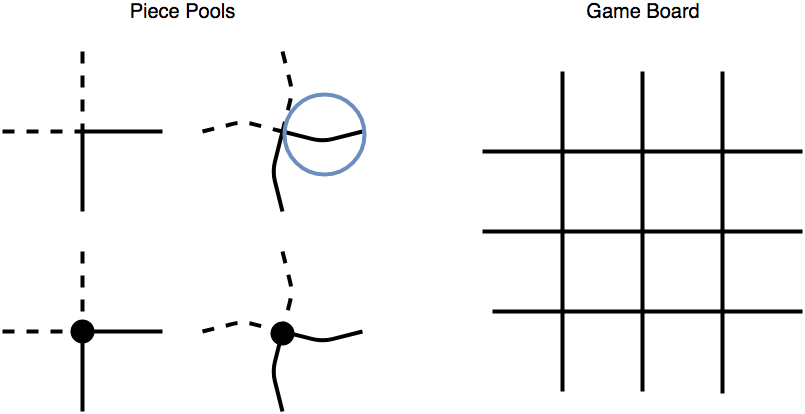
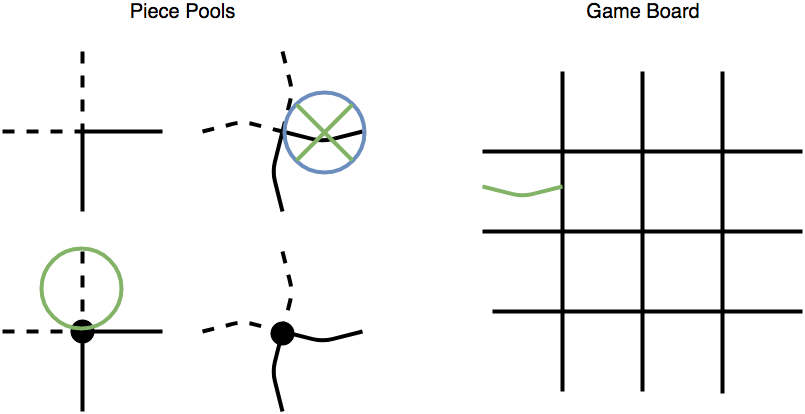
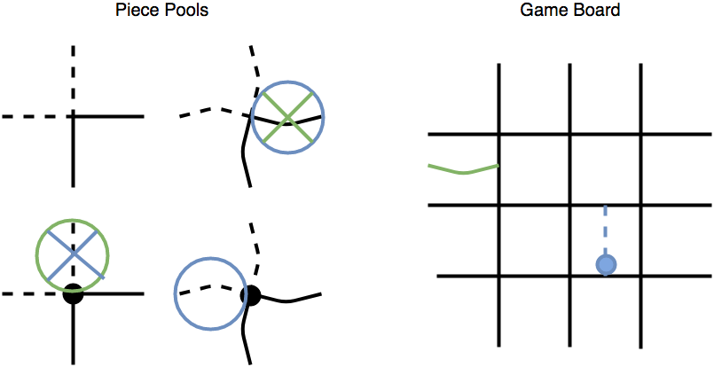

# Papyrto

Papyrus (Paper) + Quarto = Papyrto

This is an adaptation of the board game [Quarto](https://en.wikipedia.org/wiki/Quarto_(board_game)) meant to be played with pen(cil) and paper.

# Directions

Draw the play board, a grid with 3 horizontal and 3 vertical lines giving a board 4 squares by 4 squares.

Draw the 4 piece pools. Each pool should have 4 lines total. 2 vertical lines and 2 horizontal lines. 2 dashed lines and 2 solid lines. Two pools use straight lines, two pools use slightly curved lines. Two pools have no dot, two pools have a large dot in the middle. This gives 16 unique 'pieces' each with 4 characteristics. A piece is either vertical or horizontal, dashed or solid, curved or straight, and dotted or not.

  

# Rules

The rules are the same as Quarto. Player 1 selects a piece for Player 2 to play by drawing a circle around that piece in the piece pool. Player 2 plays the piece by drawing a copy of the same piece into an empty square on the board, then crossing out the piece in the pool. Then Player 2 circles a piece for Player 1 to play and so forth.

The first player to place a piece which results in 4 pieces in a row that all have the same of one of the 4 attributes. So 4 pieces that are all horizontal, or all have dots, or all don't have dots, or are all dotted, etc.

# Examples

Player 1 (blue ink) selects a piece for Player 2 to place. Note: different ink colors are not necessary during play. They are used here to simplify what is happening.

  

Player 2 (green ink) places the piece, crosses out the piece they placed, and then selects a piece for Player 1 (blue ink) to place.

  

This continues again.

  

In this board, whoever placed the last piece of the highlighted 4 pieces is the winner. All 4 pieces are curved.

  

